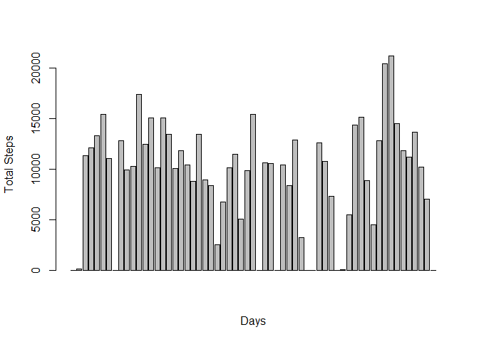
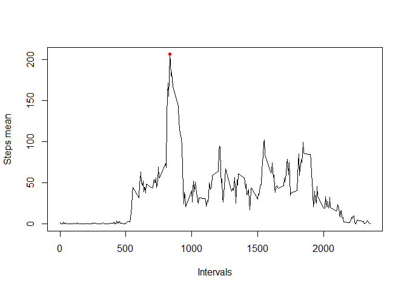
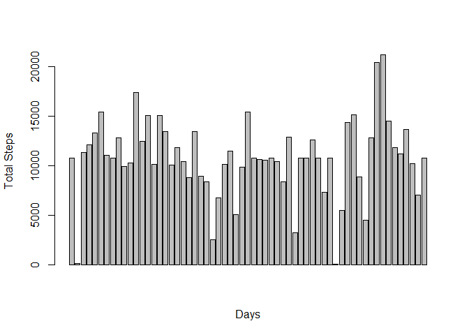
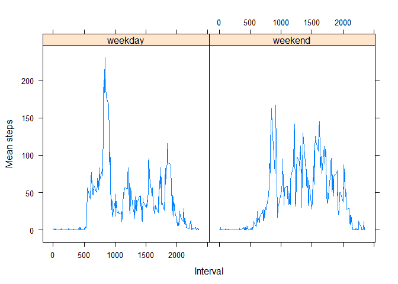

## Loading and preprocessing the data

```r
activity <- read.csv("activity.csv")
head(activity)
```

```
##   steps       date interval
## 1    NA 2012-10-01        0
## 2    NA 2012-10-01        5
## 3    NA 2012-10-01       10
## 4    NA 2012-10-01       15
## 5    NA 2012-10-01       20
## 6    NA 2012-10-01       25
```

## What is mean total number of steps taken per day?

```r
library("dplyr")
```

```
## Warning: package 'dplyr' was built under R version 3.6.2
```

```
## 
## Attaching package: 'dplyr'
```

```
## The following objects are masked from 'package:stats':
## 
##     filter, lag
```

```
## The following objects are masked from 'package:base':
## 
##     intersect, setdiff, setequal, union
```

```r
act0 <- activity %>% group_by(date) %>% summarise(total.steps = sum(steps,na.rm=TRUE))
```


```r
mean(act0$total.steps,na.rm=TRUE)
```

```
## [1] 9354.23
```


```r
median(act0$total.steps,na.rm=TRUE)
```

```
## [1] 10395
```

```r
barplot(act0$total.steps)
```

<!-- -->


## What is the average daily activity pattern?


```r
act1 <- activity %>% group_by(interval) %>% summarise(mean.steps = mean(steps,na.rm=TRUE))
```


```r
max(act1$mean.steps)
```

```
## [1] 206.1698
```

Max = 206.170  =>  Interval = 835


```r
plot(x=act1$interval,y=act1$mean.steps,type="l",xlab = "Intervals",ylab="Steps mean")
points(835,206.170,pch=20,col="red")
```

<!-- -->


## Imputing missing values

```r
head(colSums(is.na(activity)))
```

```
##    steps     date interval 
##     2304        0        0
```

There is only missing values in steps column.

Fill missing values with mean values from act1 (previous section).


```r
act2 <- activity

for (i in 1:17568) {
    if (is.na(act2[i,1])){
        val<- subset(act1,act1$interval == act2[i,3])
        act2[i,1] <- val$mean.steps
    }
}
```


```r
act3 <- act2 %>% group_by(date) %>% summarise(total.steps = sum(steps,na.rm=TRUE))
```


```r
mean(act3$total.steps,na.rm=TRUE)
```

```
## [1] 10766.19
```


```r
median(act3$total.steps,na.rm=TRUE)
```

```
## [1] 10766.19
```


```r
barplot(act3$total.steps)
```

<!-- -->


## Are there differences in activity patterns between weekdays and weekends?

###1. Create a new factor variable 


```r
library(lubridate)
```

```
## 
## Attaching package: 'lubridate'
```

```
## The following object is masked from 'package:base':
## 
##     date
```

```r
act2$day <- wday(act2$date)

act2$w.days <- ifelse(act2$day %in% 2:6,"weekday","weekend")
act2$w.days <- as.factor(act2$w.days)
```

2.Make a panel plot  


```r
act4 <- act2 %>% group_by(w.days,interval) %>% summarise(mean.steps = mean(steps,na.rm=TRUE))


library(lattice)
with(act4, xyplot(act4$mean.steps ~ act4$interval | act4$w.days , type = "l",xlab="Interval",ylab = "Mean steps"))
```

<!-- -->


